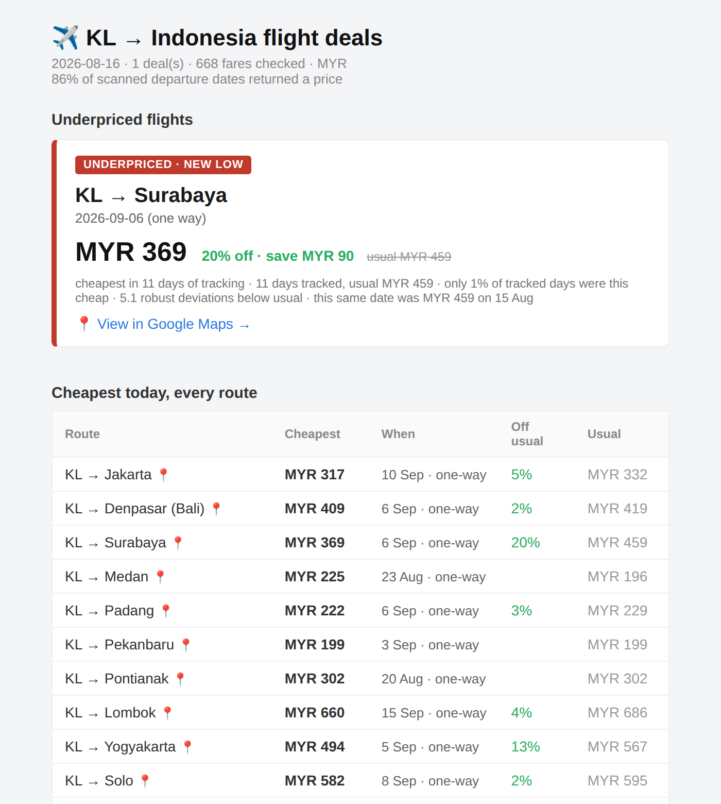

# ✈️ Cheap Flights Tracker

**Finds genuinely underpriced flights out of Kuala Lumpur — not just cheap ones.**

[](https://github.com/faeezmnoor/cheapflightstracker/actions/workflows/ci.yml)
[](LICENSE)


Every morning it prices **26 Indonesian airports** from **KL**, across **every
departure date in the next 30 days**, and emails you the fares that are unusual
*for that route* — not the ones that happen to be low.

It runs on GitHub Actions, reads live fares from Google Flights with **no API key**,
and sends the digest over SMTP. Nothing to host, nothing to pay for.

<p align="center">
  
  <br>
  <sub>A real digest, replayed from recorded history — not a mock-up.
  Regenerate with <code>python scripts/render_preview.py</code>.</sub>
</p>

---

## The problem

"Cheap" is not a useful signal. KL→Medan at MYR 150 is ordinary; KL→Jakarta at
MYR 150 is a genuinely good deal. A single price threshold either floods you with
short-haul noise or hides every real bargain on the longer routes.

So the only question worth asking is whether a fare is cheap **relative to that
route's own history** — which means every route needs its own baseline, and the
baseline has to survive bad data.

## How it decides

Airfare distributions are **right-skewed**: a hard floor at the carrier's base
fare, a long tail of flexible and multi-stop fares, and the occasional scrape that
misses the cheap itineraries and records several times the norm. Mean and standard
deviation are the wrong tools for that shape — one reading at 9,475 inflates the
scale enough to hide every genuine dip afterwards.

So it uses **median and MAD** (median absolute deviation), which an outlier cannot
move, and asks three questions of the route's own history of daily-cheapest fares:

| Question | Measure | Why it matters |
|---|---|---|
| **Is it rare?** | percentile rank — *"only 20% of tracked days were this cheap"* | No distributional assumptions. The honest measure of unusual. |
| **Is it anomalous?** | modified z-score (MAD-based) | Comparable across routes: −3 means the same on a MYR 200 fare and a MYR 2,000 one. |
| **Is it a new low?** | cheaper than anything on record | Strongest signal, and naturally noise-resistant — bad scrapes push prices *up*, so they cannot fake a low. |

A fare qualifies on a new low, on landing in the rare tail, or on a large discount
**that is also still rare** — always behind two floors: **≥12% off and ≥MYR 40
saved**. Without them, a route sitting at one price all week scores z = −4.75 on a
dip most travellers would shrug at. **Severe** requires *rare **and** large* — a
big z-score alone is never enough.

That rarity requirement on the discount path is not decoration. A fare that steps
down to a new level and holds there keeps scoring the same discount until the
median catches up days later: one route sat at exactly the same price for four
days while the headline stayed "23% off" and its percentile climbed 0% → 17% →
29% → 38%. By day four the email was announcing a week-old price change as
today's opportunity.

## Not saying the same thing twice

Statistics decide whether a fare is *unusual*. They cannot decide whether it is
*news*. A fare that stays cheap stays unusual, and would otherwise be re-sent every
morning until the median caught up with it.

So each alert is recorded, and a route is only mentioned again once the fare drops
a further 5% or a week has passed.

## How it checks itself

Every defect this project has shipped produced a *plausible* email — arriving on
time, rendering correctly, and wrong. None of them crashed. The test suite was
green for all of them. So "it ran" is not treated as evidence of anything.

[`qa/`](qa/) is an independent auditor: it re-derives every number from the raw
price history with a **second, separately written implementation** and compares
that against what the email claims. It deliberately does not import `flightdeals` —
two derivations that agree is evidence, one implementation checking itself is not,
and a test enforces the separation.

It runs **before the email is sent**. A blocking finding withholds the alerts and
says so in a banner, keeping the cheapest-today table — because a silently shorter
email is indistinguishable from a quiet morning, which is how several incidents ran
unnoticed for days.

Fifteen checks, each traceable to a real incident in
[`docs/POSTMORTEMS.md`](docs/POSTMORTEMS.md). Two are worth singling out, because
they guard the failure this data source actually has:

> The provider answers a **throttled** request with HTTP 200 and an empty itinerary
> list — byte-for-byte what "no flights that day" looks like. Coverage can fall by
> a third with every run reporting success and no error logged anywhere. And a
> route priced from 2 of 30 dates always reads *high*, because the dates that go
> missing are disproportionately the cheap ones.

Those rows are labelled *"partial scan · only N of 30 dates returned"* in the
digest, never alerted on, and never written to history — an inflated daily-cheapest
would raise the median and manufacture a fake bargain tomorrow. The header states
coverage outright, in red below 75%.

```bash
python scripts/replay_audit.py --all     # replay every recorded day past the auditor
python scripts/check_liveness.py         # did the job run, and did it see anything?
```

`replay_audit.py` is the real pre-merge gate: it re-runs past days against real
recorded history, so a change that would have sent a wrong email on a day that
actually happened fails in CI rather than in an inbox.

## Looking further out than 30 days

The daily window is the *wrong end* of the booking curve. Measured on this
project's own recorded prices, normalised per route:

| Days before departure | 1–5 | 6–10 | 11–15 | 16–20 | 21–25 | 26–30 |
|---|---|---|---|---|---|---|
| Relative price | **1.077** | 1.014 | 1.040 | 1.000 | **0.937** | 0.972 |

Fares 3–4 weeks out run ~10% below fares booked inside a week, and the curve has
not bottomed by day 30. Southeast Asia is repeatedly measured to bottom at 3–6
months, and AirAsia's sale campaigns sell travel 6–12 months ahead — none of which
a 30-day window can see.

So [`scripts/horizon_scan.py`](scripts/horizon_scan.py) scans **two contiguous
30-day blocks** (3 and 5 months out) in full, weekly, into its own store. Results
appear under *"Cheaper if you fly later"*, never merged into the alerts.

Blocks, not a sparse sample — that was the first design and it could not support
its own conclusion. Taking 10 of 30 dates **misses the true cheapest fare 41% of
the time and reads a mean 13.9% high**, the same size as the discount it was meant
to find. Coverage *is* the bias, so both windows must clear 80% before they are
compared at all.

One honest limit: a block five months out is also a different *season*, so the
section claims "cheaper to **fly** then", not "book early and save". A single
comparison cannot separate the two.

## How it works

```
 GitHub Actions (daily cron)
        │
        ▼
   run.py ──► flightdeals.main.run()
        │
        ├─ search.py       every route × every date in the window
        ├─ baseline.py     route "usual price" + per-departure-date series
        ├─ detector.py     confirmed price drops, then merely cheap dates
        ├─ qa/checks.py    audit the digest BEFORE it sends; withhold on doubt
        ├─ emailer.py      build + send the HTML/text digest via SMTP
        └─ baseline.py     append today's fares, commit history back to the repo
```

Price history lives in the repo itself, committed by the daily job — no database.
The data source is pluggable: implement `search()` on `FlightProvider` in
[`flightdeals/providers/`](flightdeals/providers/) and select it with `PROVIDER=`.
A `mock` provider ships for offline demos and tests.

## Setup (about 5 minutes)

Because the data source needs no API key, the only thing to configure is email.

1. **Create a Gmail app password** — enable 2-Step Verification, then generate one
   at [myaccount.google.com/apppasswords](https://myaccount.google.com/apppasswords).
2. **Add repository secrets** (Settings → Secrets and variables → Actions):

   | Secret | Value |
   |--------|-------|
   | `SMTP_USER` | the Gmail address the digest is sent *from* |
   | `SMTP_APP_PASSWORD` | the 16-character app password |
   | `EMAIL_TO` | where to send it (defaults to `SMTP_USER`) |

3. **Turn it on** — the workflow runs daily. To test now: Actions → *Daily flight
   deals* → Run workflow (tick *dry_run* to preview without sending).

> **Expect it late.** The cron says 01:00 UTC, but GitHub queues scheduled
> workflows best-effort and no run in this project's history has ever started on
> time — every one has fired 2–3 hours behind. Don't conclude a run is missing
> before ~05:00 UTC. Doing so once produced a duplicate digest 25 minutes before
> the real one arrived.

## Run it locally

```bash
pip install -r requirements.txt

python run.py --provider mock --dry-run   # offline demo, prints the email
python run.py --dry-run                   # real fares, still doesn't send
python -m unittest discover -s tests      # stdlib only, no network
```

## Pointing it somewhere else

Nothing about the machinery is specific to Indonesia — only the default route list.

```bash
ORIGIN=SIN                       # any IATA origin
ROUTES=BKK,HKT,CNX,DMK           # any destinations
CURRENCY=SGD  REGION=sg          # price it in the market you buy from
```

Google prices by market, so `REGION` and `LANGUAGE` make the runner see the fares a
local shopper sees. Every setting is an env var — see [`.env.example`](.env.example).

`scripts/probe_destinations.py` tells you which candidate airports are actually
reachable from an origin before you commit 30 searches a day to each. It is how
Yogyakarta got caught: configured as JOG, which handles only domestic traffic, the
route returned nothing every day for a week without ever erroring.

## Contributing

Issues and pull requests are welcome. The test suite is stdlib-only and needs no
network, so `python -m unittest discover -s tests` runs in well under a second.

Two things worth knowing before changing how fares are scored:

- **A green test suite is not evidence.** It was green for every incident in
  [`docs/POSTMORTEMS.md`](docs/POSTMORTEMS.md). Run
  `python scripts/replay_audit.py --all` — that is the check that catches things.
- **Every past bug has a regression test** naming the incident it reproduces.
  Start there.

[`CLAUDE.md`](CLAUDE.md) carries the invariants, each written after breaking one.
[`docs/RUNBOOK.md`](docs/RUNBOOK.md) is what to do when a digest looks wrong, and
[`docs/COMPETITOR-ANALYSIS.md`](docs/COMPETITOR-ANALYSIS.md) records which industry
techniques were adopted, rejected, and why — including two rejected on
measurements of this project's own data.

## Notes

- **Unofficial data source.** Fares come from Google Flights' public web endpoint
  via [`fast-flights`](https://github.com/AWeirdDev/flights). There is no free
  official flight-price API, and this can break if Google changes their page
  format. Intended for personal, low-volume monitoring — please respect Google's
  terms and don't point it at a route list large enough to be a nuisance.
- **Baselines need a few days.** Until a route has 5 days of history it shows
  "building baseline" and won't flag anything, by design.
- **No hidden-city ticketing.** Skiplagging saves real money and is deliberately
  not implemented: it breaches essentially every carrier's contract, enforcement
  lands on the passenger's account and miles, and on short-haul point-to-point
  routes like these the upside is close to zero. Reasoning in
  [`docs/COMPETITOR-ANALYSIS.md`](docs/COMPETITOR-ANALYSIS.md).
- **Always confirm before booking.** An alert is a prompt to look, not a quote.

## License

[MIT](LICENSE)
